# Guía de práctica: patrones de arquitectura en Spring Boot

**Proyecto:** Shop Academy (pedidos, pagos y envíos). **Objetivo:** que *tú* escribas el código. Esta guía te da el problema, el diseño, los requisitos y los tests que debes hacer pasar. No trae implementaciones.

## Cómo usar esta guía

Para cada patrón sigue siempre el mismo ciclo:

1. Lee el **problema** y mira el **diagrama**.
2. Escribe primero los **tests** de la sección "Debes demostrar que".
3. Implementa hasta ponerlos en verde.
4. Revisa "Errores típicos".
5. Si quieres revisión, pega tu código en el chat y lo comentamos.

---

## 1. Arquitectura base: hexagonal

### Idea

El **dominio** (reglas del negocio) está en el centro y no conoce ninguna tecnología. Todo lo demás (base de datos, web, pasarelas) está fuera y depende del dominio, nunca al revés.

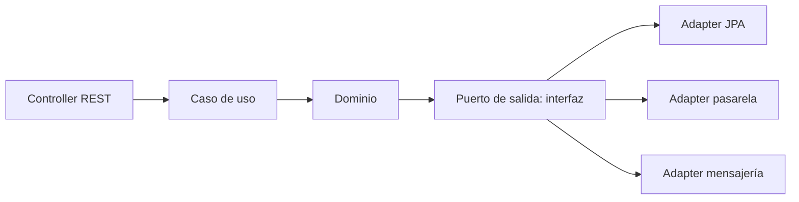

- **Puerto:** una interfaz que define el dominio (ej. `OrderRepository`).
- **Adapter:** la clase de infraestructura que implementa ese puerto (ej. el adapter que usa JPA).

### Paquetes

```
com.academy.shop
├── domain          (model, state, event, port.in, port.out)
├── application     (checkout, pricing, shipping, payment)
├── infrastructure  (persistence, payment, messaging, web)
└── config
```

### La duda de `@Entity`

`@Entity` es de Jakarta, no de Spring. Tienes dos caminos:

|  | Pragmática | Estricta (recomendada aquí) |
| --- | --- | --- |
| `@Entity` en el dominio | Sí | No |
| Clases por concepto | 1 | 2 (dominio + entidad JPA) |
| Mapper entre ambas | No | Sí (MapStruct) |
| Ventaja | Menos código | Dominio testeable sin BD ni framework |

Sobre Lombok: usa `@Getter`, `@Builder` y constructores. **Evita `@Data` en entidades**: genera setters públicos (rompe las reglas del negocio) y `equals/hashCode` problemáticos con Hibernate.

### Debes demostrar que

- Una clase del dominio se puede instanciar y probar con JUnit puro, sin arrancar Spring.
- Un test de **ArchUnit** falla si alguien importa `org.springframework` en `domain` (y `jakarta.persistence` si eliges la estricta).

---

## 2. Librerías

| Uso | Dependencia (artifactId) |
| --- | --- |
| Web, JPA, validación, AOP, actuator | `spring-boot-starter-web`, `-data-jpa`, `-validation`, `-aop`, `-actuator` |
| Base de datos | `postgresql`, `flyway-core`, `flyway-database-postgresql` |
| Productividad | `lombok`, `mapstruct` (+ `mapstruct-processor`, `lombok-mapstruct-binding`) |
| Resiliencia | `resilience4j-spring-boot3` |
| Documentación API | `springdoc-openapi-starter-webmvc-ui` |
| Tests | `spring-boot-starter-test`, `testcontainers` (`postgresql`, `junit-jupiter`), `archunit-junit5` |

Java 21 y Spring Boot 3.3 o superior. En IntelliJ activa *Enable annotation processing* para Lombok y MapStruct.

---

## 3. Base de datos

### Migración `V1__init.sql`

Ruta: `src/main/resources/db/migration/V1__init.sql`

```sql
CREATE TABLE customers (
  id            BIGSERIAL PRIMARY KEY,
  full_name     VARCHAR(120) NOT NULL,
  email         VARCHAR(150) UNIQUE NOT NULL,
  loyalty_level VARCHAR(20)  NOT NULL DEFAULT 'BASIC'
);

CREATE TABLE products (
  id    BIGSERIAL PRIMARY KEY,
  sku   VARCHAR(40)  UNIQUE NOT NULL,
  name  VARCHAR(150) NOT NULL,
  price NUMERIC(12,2) NOT NULL CHECK (price >= 0),
  stock INT NOT NULL CHECK (stock >= 0)
);

CREATE TABLE coupons (
  code       VARCHAR(30) PRIMARY KEY,
  percent    NUMERIC(5,2) NOT NULL CHECK (percent BETWEEN 0 AND 100),
  expires_at DATE
);

CREATE TABLE orders (
  id            BIGSERIAL PRIMARY KEY,
  customer_id   BIGINT NOT NULL REFERENCES customers(id),
  status        VARCHAR(20) NOT NULL,
  shipping_type VARCHAR(20) NOT NULL,
  coupon_code   VARCHAR(30) REFERENCES coupons(code),
  subtotal      NUMERIC(12,2) NOT NULL DEFAULT 0,
  discount      NUMERIC(12,2) NOT NULL DEFAULT 0,
  shipping_cost NUMERIC(12,2) NOT NULL DEFAULT 0,
  total         NUMERIC(12,2) NOT NULL DEFAULT 0,
  created_at    TIMESTAMP NOT NULL DEFAULT now()
);

CREATE TABLE order_items (
  id         BIGSERIAL PRIMARY KEY,
  order_id   BIGINT NOT NULL REFERENCES orders(id) ON DELETE CASCADE,
  product_id BIGINT NOT NULL REFERENCES products(id),
  quantity   INT NOT NULL CHECK (quantity > 0),
  unit_price NUMERIC(12,2) NOT NULL
);

CREATE TABLE payments (
  id           BIGSERIAL PRIMARY KEY,
  order_id     BIGINT NOT NULL REFERENCES orders(id),
  method       VARCHAR(20) NOT NULL,
  status       VARCHAR(20) NOT NULL,
  external_ref VARCHAR(100),
  amount       NUMERIC(12,2) NOT NULL
);

CREATE TABLE order_status_history (
  id          BIGSERIAL PRIMARY KEY,
  order_id    BIGINT NOT NULL REFERENCES orders(id),
  from_status VARCHAR(20),
  to_status   VARCHAR(20) NOT NULL,
  changed_at  TIMESTAMP NOT NULL DEFAULT now()
);

CREATE TABLE outbox_events (
  id           BIGSERIAL PRIMARY KEY,
  aggregate_id BIGINT NOT NULL,
  event_type   VARCHAR(60) NOT NULL,
  payload      JSONB NOT NULL,
  published    BOOLEAN NOT NULL DEFAULT FALSE,
  created_at   TIMESTAMP NOT NULL DEFAULT now()
);
```

### Diagrama entidad-relación

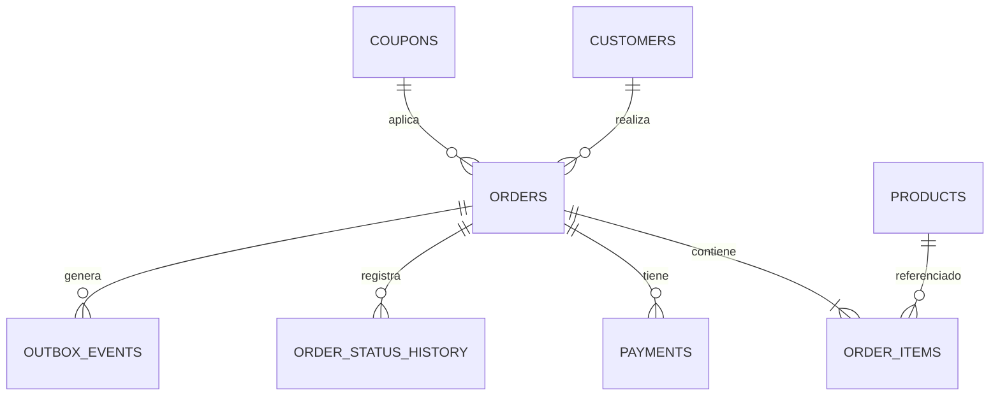

---

# FASE 1: Fundamentos del dominio

## Value Object: `Money`

**Problema:** manejar dinero con `double` provoca errores de redondeo, y pasar `BigDecimal` suelto por todas partes no expresa reglas.

**Debes construir:** una clase inmutable con monto y moneda.

**Debes demostrar que:**

- No puedes crear un `Money` negativo ni con monto nulo.
- `sumar`, `restar`, `multiplicar` y `restarPorcentaje` devuelven un objeto **nuevo**; el original no cambia.
- No se pueden sumar monedas distintas.
- Dos `Money` con el mismo monto y moneda son iguales (`equals`/`hashCode`).
- `10.00` y `10.0` son iguales (cuidado con `BigDecimal.equals` vs `compareTo`).

**Errores típicos:** usar `double`; olvidar la escala (2 decimales) y el modo de redondeo.

## Patrón Builder: `Order`

**Problema:** un pedido tiene campos obligatorios y opcionales (cupón, notas). Un constructor con muchos parámetros es ilegible.

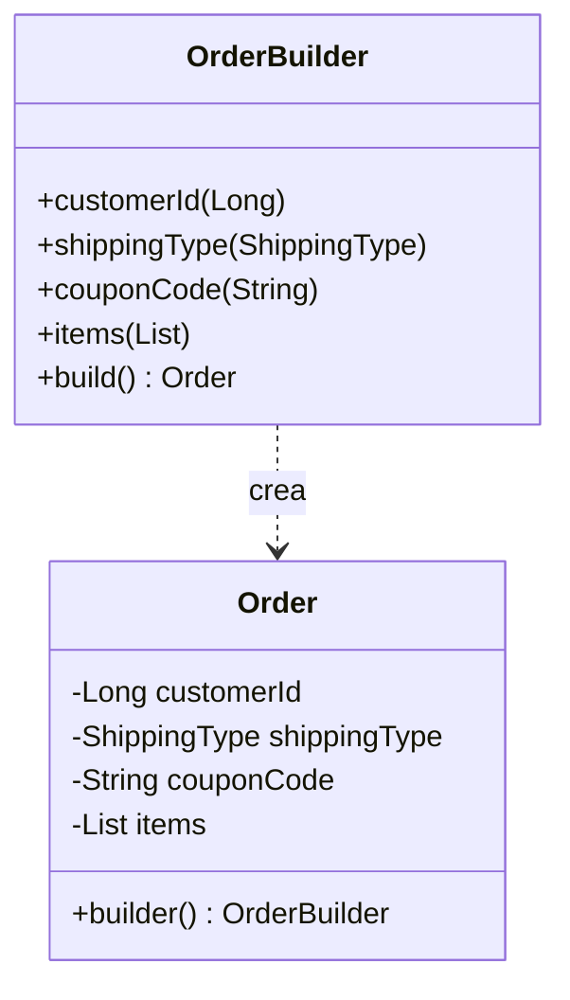

**Debes construir:** `Order` con constructor privado y un builder.

**Debes demostrar que:**

- Sin cliente, sin tipo de envío o sin ítems, `build()` lanza excepción.
- Un pedido sin cupón es válido.
- La lista de ítems no se puede modificar desde fuera.
- No existen setters públicos.

**Errores típicos:** validar en el builder en lugar de en el constructor (se puede saltar); usar `@Data`.

## Patrón Repository (puerto + adapter)

**Problema:** el dominio necesita guardar pedidos, pero no debe saber que existe JPA.

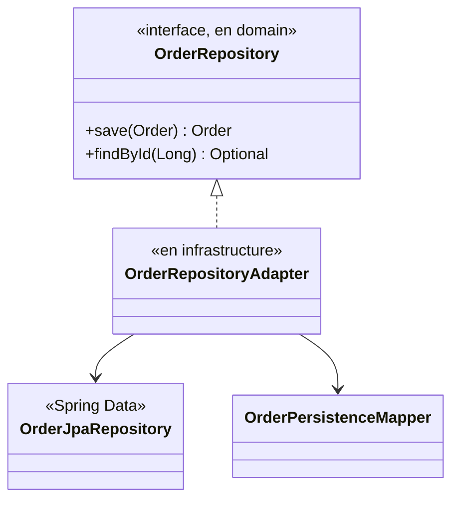

**Debes construir:** el puerto en `domain`, y en `infrastructure.persistence` la entidad JPA, el repositorio Spring Data, el mapper y el adapter.

**Debes demostrar que** (con `@DataJpaTest` o `@SpringBootTest` + Testcontainers + Flyway):

- Guardas un `Order` y lo recuperas con los mismos datos, incluidos los ítems.
- `findById` de un id inexistente devuelve vacío.
- El test de ArchUnit de la sección 1 sigue en verde.

**Errores típicos:** que la entidad JPA se filtre al dominio; olvidar `orphanRemoval`/cascade en los ítems; que el mapper pierda el estado.

---

# FASE 2: Pagos y envíos

## Patrón Factory: procesadores de pago

**Problema:** cada método de pago (tarjeta, Yape, PayPal) se procesa distinto. Un `switch` en el servicio obliga a modificarlo cada vez que aparece uno nuevo.

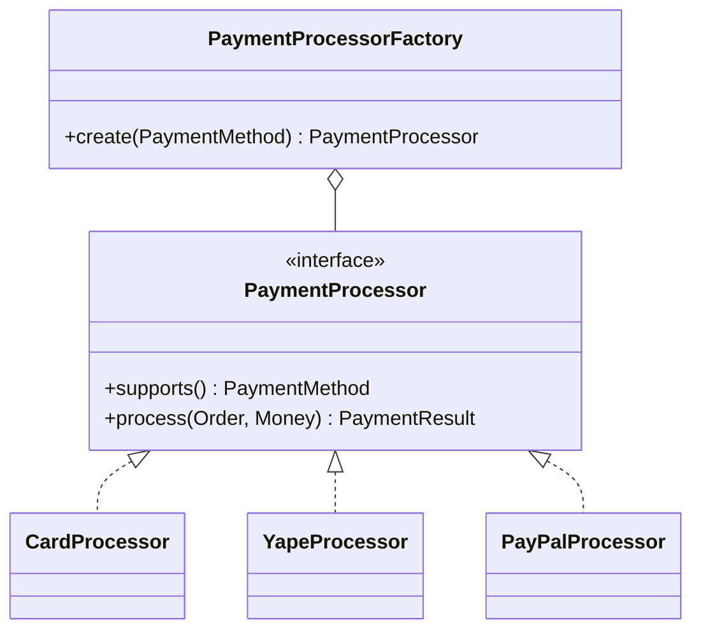

**Debes construir:** la interfaz, tres procesadores y una factory que reciba **todas** las implementaciones por inyección (pista: Spring inyecta una `List<PaymentProcessor>`).

**Debes demostrar que:**

- `create(CARD)` devuelve el procesador de tarjeta, y así con los demás.
- Un método sin procesador lanza una excepción propia.
- **Test clave:** crea un procesador falso solo en el test, pásalo a la factory y verifica que lo resuelve **sin tocar la factory**.

**Errores típicos:** dejar un `switch` dentro de la factory; que dos procesadores declaren el mismo método (¿qué debería pasar?).

## Patrón Adapter: pasarelas externas

**Problema:** cada proveedor externo tiene su propia API. Tu aplicación quiere una sola interfaz.

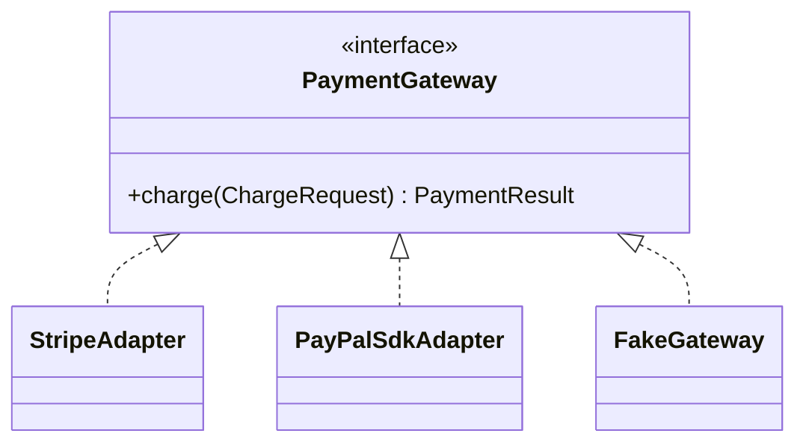

**Debes construir:** el puerto `PaymentGateway`, y un `FakeGateway` que apruebe o rechace según el monto (no necesitas cuentas reales). Opcional: un adapter simulado con formato de respuesta "extraño" que tu adapter debe traducir.

**Debes demostrar que:**

- El procesador de tarjeta funciona igual con cualquier `PaymentGateway`.
- El adapter traduce estados externos ("succeeded", "declined") a tu `PaymentStatus`.

**Errores típicos:** que tipos del SDK externo aparezcan en el dominio.

## Patrón Strategy: costo de envío

**Problema:** el costo se calcula distinto según el tipo de envío.

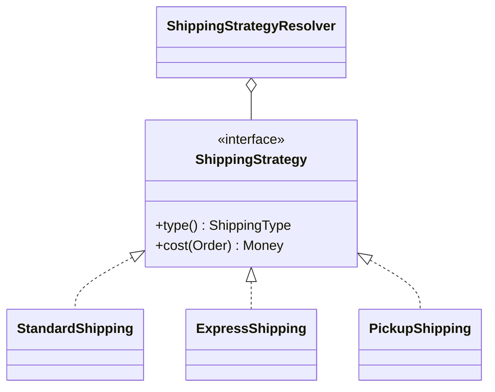

**Reglas de negocio a implementar** (invéntalas tú y fíjalas en los tests): estándar = tarifa plana; exprés = tarifa base + recargo por unidad; recojo en tienda = gratis.

**Debes demostrar que:**

- Cada estrategia calcula su costo correctamente.
- El resolver elige la estrategia según `ShippingType`.
- Agregar una estrategia nueva no modifica las existentes.

**Diferencia con Factory:** Factory *entrega un objeto*; Strategy *intercambia un algoritmo*. El código se parece, la intención no. Escribe en un comentario tu propia explicación.

---

# FASE 3: Cálculo de precio y checkout

## Patrón Decorator: descuentos apilables

**Problema:** el precio puede llevar cupón, descuento de fidelidad, promos... en cualquier combinación.

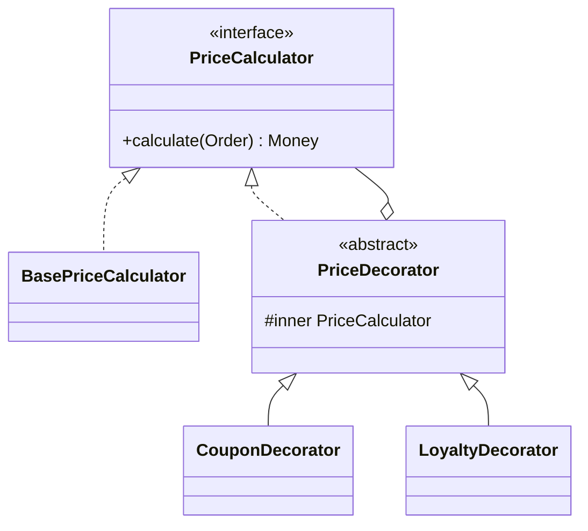

**Reglas a implementar:** cupón con porcentaje (ignorar si está vencido o no existe); fidelidad GOLD y SILVER con porcentajes distintos.

**Debes demostrar que:**

- Sin decoradores, el precio es la suma de los ítems.
- Con cupón, con fidelidad, y con ambos, el resultado es el esperado.
- Un cupón vencido no aplica.
- Pregunta de reflexión: ¿importa el orden de los decoradores? Escribe un test con dos órdenes y decide si el resultado debe ser igual.

**Errores típicos:** que el decorador no delegue en `inner`; mezclar lógica de varios descuentos en una sola clase.

## Patrón Chain of Responsibility: validaciones del checkout

**Problema:** antes de cobrar hay varias comprobaciones que se ejecutan en orden y cualquiera puede detener el proceso.

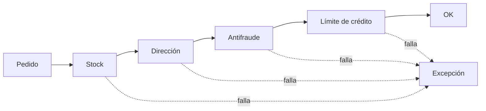

**Debes construir:** una interfaz de validador, al menos tres validadores concretos, y un componente que los ejecute en un orden definido.

Hazlo **de dos formas** y compáralas:

1. Cadena clásica, cada validador conoce al siguiente.
2. Lista ordenada inyectada por Spring.

**Debes demostrar que:**

- Si el primer validador falla, los siguientes **no** se ejecutan.
- El orden es el esperado.
- Añadir un validador nuevo no toca los existentes.

## Patrón Facade: `CheckoutFacade`

**Problema:** el controller no debe conocer validaciones, precios, envío, pago ni eventos.

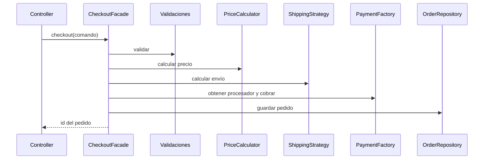

**Debes construir:** un caso de uso `CheckoutUseCase` (interfaz en `domain.port.in`) y su implementación con el orden de pasos mostrado, más un endpoint `POST /checkout`.

**Debes demostrar que** (con Mockito para colaboradores):

- Flujo feliz: devuelve el id y guarda el pedido.
- Si una validación falla, no se cobra.
- Si el pago es rechazado, el pedido no queda como pagado.
- El controller solo llama a la fachada.

**Errores típicos:** poner lógica de negocio en el controller; olvidar la transacción.

---

# FASE 4: Estado, eventos e importación

## Patrón State: ciclo de vida del pedido

**Problema:** condiciones tipo `if (status == PAID)` repartidas por todo el código.

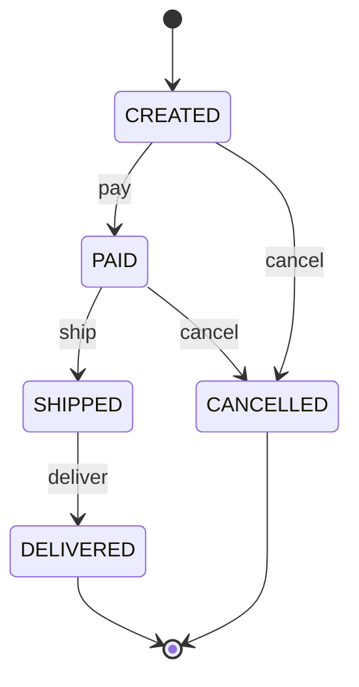

**Debes construir:** una interfaz de estado y una clase por estado. `Order` delega en su estado actual. Cada transición se registra en un historial.

**Debes demostrar que** (tests de dominio, sin Spring):

- Cada transición válida cambia al estado esperado.
- Cada transición inválida (por ejemplo cancelar un pedido entregado) lanza excepción.
- Cada transición queda en el historial con estado origen y destino.
- Al guardar y recuperar un pedido, su estado se reconstruye correctamente (pista: ¿quién convierte `OrderStatus` en un objeto `OrderState`?).

**Errores típicos:** dejar un `enum` con `switch` y llamarlo State; permitir un setter de estado.

## Patrón Observer: eventos de Spring

**Problema:** al pagar, deben ocurrir varias cosas (email, stock, factura) sin que el checkout las conozca.

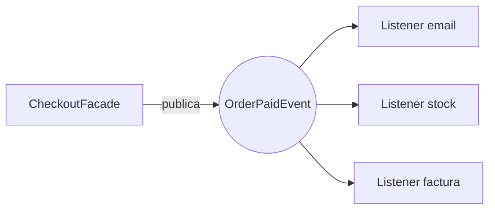

**Debes construir:** el evento como objeto inmutable y tres listeners independientes.

**Debes demostrar que:**

- Al pagar, los tres listeners reciben el evento.
- Si un listener falla, ¿qué pasa con los otros y con el pedido? Decide y documenta el comportamiento.
- Con `@TransactionalEventListener` en fase `AFTER_COMMIT`, **no** se envía el email si la transacción hace rollback (pruébalo).

**Errores típicos:** llamar directamente al servicio de email desde el checkout; olvidar `@EnableAsync` si usas `@Async`.

## Patrón Template Method: importación de productos

**Problema:** importar productos desde CSV y JSON comparte el mismo proceso (leer, validar, guardar) y solo cambia cómo se lee.

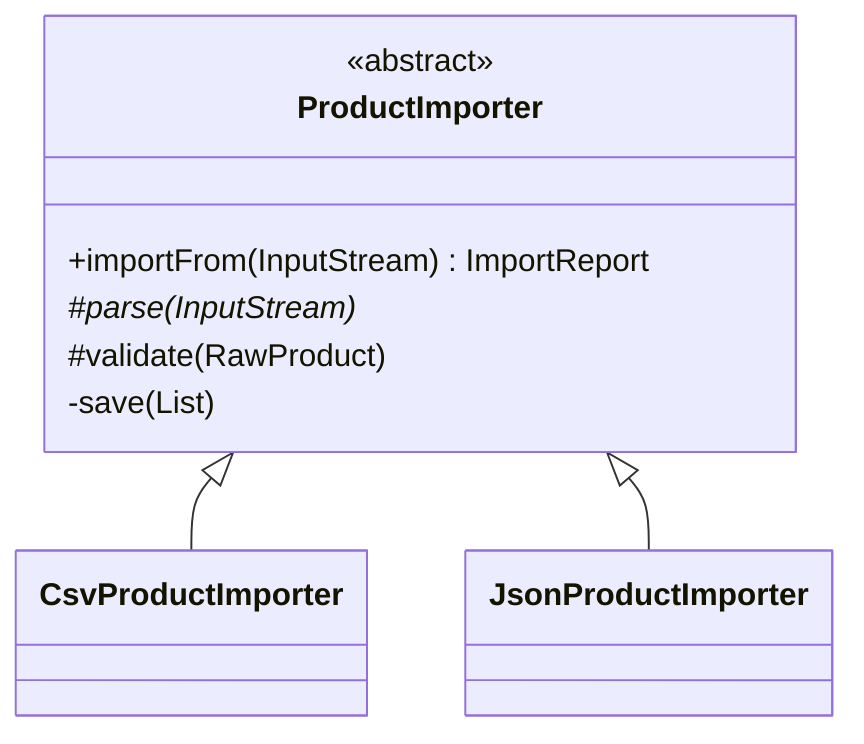

**Debes construir:** una clase abstracta con el método plantilla `final` y dos implementaciones.

**Debes demostrar que:**

- Ambos importadores producen el mismo resultado con datos equivalentes.
- Las filas inválidas se descartan y se cuentan en el reporte.
- El método plantilla no puede sobrescribirse.

---

# FASE 5: Transversales y resiliencia

## Singleton y scopes de Spring

**Debes demostrar que:**

- Un bean por defecto es la misma instancia en todos los puntos de inyección.
- Un bean `prototype` produce una instancia nueva.
- Reproduce el bug: un `@Service` con un campo mutable compartido entre dos hilos da resultados cruzados.

## Proxy con AOP

**Problema:** logs, auditoría y medición de tiempos no deben ensuciar la lógica de negocio.

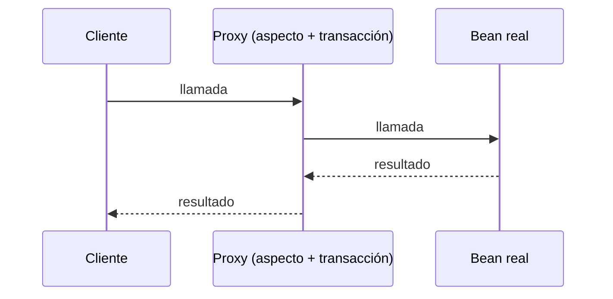

**Debes construir:** un aspecto que registre el tiempo de ejecución de todos los casos de uso.

**Debes demostrar que:**

- El aspecto se ejecuta al invocar un caso de uso desde fuera.
- **Trampa clásica:** un método `@Transactional` llamado desde otro método *de la misma clase* no aplica la transacción. Reprodúcelo con un test y arréglalo.

## Circuit Breaker y Retry (Resilience4j)

**Problema:** si la pasarela de pago cae, no debes colapsar toda la aplicación.

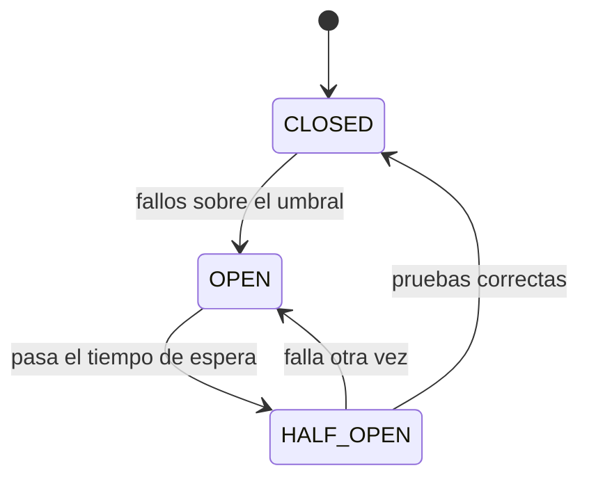

**Debes construir:** configuración en `application.yml` para una instancia, anotaciones sobre el adapter de pasarela y un método de respaldo.

**Debes demostrar que:**

- Con un gateway que falla N veces, se reintenta el número configurado.
- Tras superar el umbral, el circuito se abre y se llama al método de respaldo sin invocar al gateway.
- Qué resultado devuelve el respaldo y por qué (¿pago pendiente o rechazado?). Decide y justifica.

## Tests de arquitectura (ArchUnit)

**Debes escribir reglas para:**

- `domain` no depende de Spring, JPA, `application` ni `infrastructure`.
- `application` no depende de `infrastructure`.
- Los `@RestController` solo están en `infrastructure.web`.
- No hay ciclos entre paquetes.

**Ejercicio:** rompe cada regla a propósito y confirma que el test falla.

---

# FASE 6 (opcional): Outbox y CQRS

## Patrón Outbox

**Problema:** guardas el pedido y publicas un mensaje a un broker. Si el broker falla entre ambas operaciones, pierdes el evento o lo publicas sin pedido.

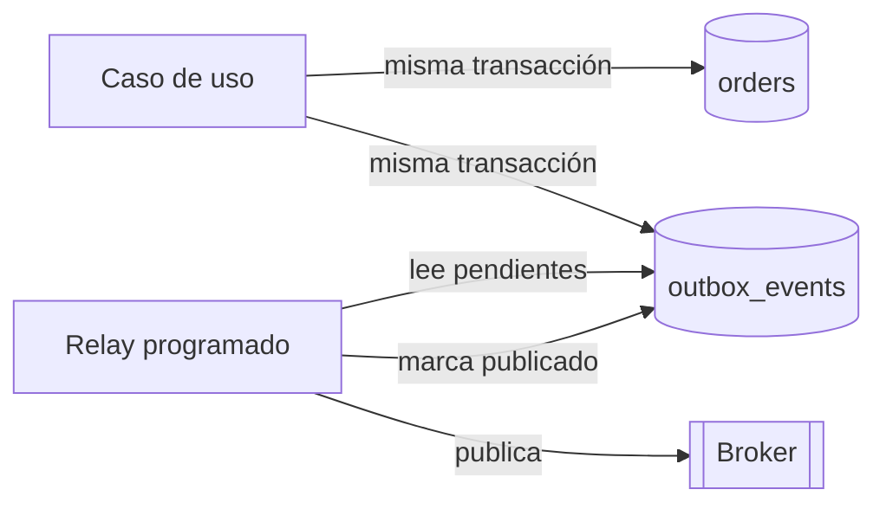

**Debes demostrar que:**

- Pedido y evento se guardan juntos o ninguno (fuerza un error entre ambos).
- El relay publica solo los pendientes y los marca.
- Si el broker falla, el evento sigue pendiente y se reintenta.
- Los consumidores deben tolerar duplicados. Explica por qué.

## CQRS ligero

**Debes construir:** un servicio de consultas separado de los casos de uso de escritura, que devuelva DTOs directamente desde la base de datos sin pasar por el dominio.

**Debes demostrar que:** la consulta de "mis pedidos" pagina y no carga entidades del dominio completas.

---

## Ejercicios finales

1. Añade un método de pago nuevo sin modificar ninguna clase existente.
2. Añade un descuento de temporada y prueba dos órdenes de decoradores.
3. Añade el estado `RETURNED` (solo desde `DELIVERED`) y actualiza el diagrama.
4. Cambia de arquitectura estricta a pragmática y compara qué ganas y qué pierdes.
5. Explica con tus palabras la diferencia entre Factory y Strategy, y entre Decorator y Chain of Responsibility.

## Cuadro de decisión

| Si necesitas... | Patrón |
| --- | --- |
| Crear un objeto según un tipo o clave | Factory |
| Intercambiar un algoritmo | Strategy |
| Apilar o combinar comportamientos | Decorator |
| Traducir una API ajena a la tuya | Adapter |
| Ocultar un flujo complejo tras una entrada simple | Facade |
| Comportamiento que depende del estado | State |
| Reaccionar a algo sin acoplar | Observer |
| Esqueleto fijo con pasos variables | Template Method |
| Validaciones en secuencia | Chain of Responsibility |
| Log, auditoría, transacciones | Proxy / AOP |
| Protegerte de fallos remotos | Circuit Breaker / Retry |
| No perder eventos | Outbox |